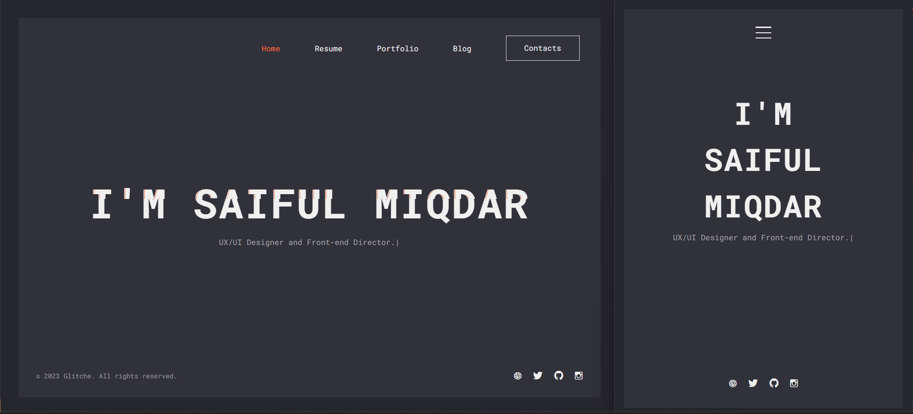

# Glitche - CV Resume Template

## New Release
[One Page](./one%20page/) 🚀
[One Page Dark](./one%20page%20dark/) 🚀
[Vcard](./vcard/) 🚀
[Vcard dark](./vcard%20dark/) 🚀

Glitche – CV Resume and Personal Portfolio HTML Template is best suited for designers, freelancers, developers, programmers, coders, or any other professions. With Glitche and all the ready-made components: Different layouts, Dark & Light versions, One & Multi pages, RTL support – creating online Resume and CV websites should no longer be difficult. Fully responsive, entirely customizable, with a unique web design that will help you win over new clients. It has loads of awesome features which will help you create a web presence. Creating a personal website with Glitche CV Resume HTML5 Template is an effective way to promote yourself and showcase your works.

## Features:

- HTML5, CSS3 & jQuery powered
- Multi and One Page
- Dark & Light Mode
- 6+ Lightbox Portfolio Variants: Image, Gallery, Media, Iframe (YouTube, Vimeo), Audio (SoundCloud), Link
- Skills with Percent & Dotted Bar, Circles, Knowledge
- Resume On Timeline
- 6+ Colors
- Fully Responsive
- Minimal and Clean
- Fully Customize
- Cross Browser
- Blog Page & Blog Details Page
- Clean code
- LESS CSS Included
- Fonts Icons
- Google Fonts

## Contact Information:

- Email: ifulxploit@gmail.com
- Phone: 083871259489
- GitHub: [https://github.com/ifulxploit](https://github.com/ifulxploit)